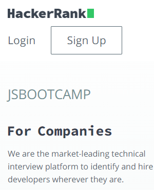

# Dom Manipulation Assignment

# 1. Website Name: [Dev To](https://dev.to/)

### Topics

    - Query Selctory, Inner HTML

### Sample Image


### Tasks

        Target the Top description div and change the DEV Community to <Your_Name> and description to your passion

### Output


## Answer
```
document.getElementsByClassName("crayons-subtitle-2 lh-tight mb-4")[1].textContent = "iNeuron";
document.getElementsByClassName("color-base-70 mb-4")[1].innerText = "I Write Code";
```
<hr>

2. Website Name: [Apple](https://support.apple.com/en-in)

### Task


### Fetch all the product name and store in an array

### Output

['iPhone', 'Mac', 'iPad', 'Watch', 'AirPods', 'Music', 'TV']

## Answer
```
let output = [];

for (let i=0; i<document.getElementsByClassName("as-imagegrid-item-title").length; i++){
    output.push(document.getElementsByClassName("as-imagegrid-item-title")[i].firstChild.data);
}

console.log(output);
```
<hr>

3. Website Name: [Youtube Support](https://support.google.com/youtube/)

### Topics

    - Get Element By Id, Create Element, Create Text Node, Append Child

### Sample Image


### Tasks

     Add another FAQ 'My New FAQ' to the list

### Output


## Answer
```
let new_section = document.createElement("section");
new_section.className = "parent";

let new_faq = document.createElement("h3");
new_faq.innerText = "My New FAQ";

new_section.appendChild(new_faq);

let topics = document.querySelector(".accordion-homepage");
topics.appendChild(new_section)

```
<hr>

4. Website Name: [OnePlus](https://www.oneplus.in/support)

### Topics

     Query Selector, InnerText

### Sample Image


### Tasks

      Change the contact number

### Output


## Answer
```
document.getElementsByClassName("one-tel-number service-number")[0].textContent = "+91 6366256689"

```
<hr>

5. Website Name: [Samsung](https://www.samsung.com/in/offer/online/samsung-fest/)

### Topics

       getElementById, createElement, InnerText, append, setAttribute

### Sample Image


### Tasks

     Target the main div of card and change the Button text to Check out

### Output


## Answer
```
for (let i=0; i<document.querySelectorAll(".diwali-deals-product-sale-btn").length; i++){
    document.querySelectorAll(".diwali-deals-product-sale-btn")[i].innerText = "Check out";
}

```
<hr>

6. Website Name: [Adidas](https://www.adidas.co.in/)

### Topics

    -   Query Selector, Event listeners, Changing Styles

### Sample Image


### Tasks

     Target the search box and on hover change thebackground color to red.

### Output


## Answer
```
let search = document.getElementsByClassName("searchinput___19uW0")[0]

function colorRed() {
    search.style.backgroundColor = "Red";
}

search.addEventListener("mouseover", colorRed);

```
<hr>

7. Website Name: [MDN Web Docs](https://developer.mozilla.org/en-US/)

### Topics

       Form, Value, Submit

### Sample Image


### Tasks

     To Search a topic in the MDN Search bar.
     First add a text to search in the search bar and then hit the submit search button to search the docs using DOM

### Output


## Answer
```
document.getElementById("top-nav-search-input").setAttribute("value", "hi" );
document.getElementsByClassName("button action has-icon search-button")[0].click()
```
<hr>

8. Website Name: [Google](https://www.google.com/)

### Topics

       Remove Elements

### Sample Image


### Tasks

     Remove alternate languages from the home page languages listed

### Output


## Answer
```

```
<hr>

9. Website Name: [Code Wars](https://www.codewars.com/)

### Topics

       Change Font Family, Color of Text.

### Sample Image


### Tasks

    Change the font family of the text to monospace and text color to the logo’s background color.

### Output


## Answer
```
document.getElementsByClassName("display-heading-1")[0].style.fontFamily = "monospace"

document.getElementsByClassName("display-heading-1")[0].style.color = "Red"

```
<hr>

10. Website Name: [Freecodecamp](https://www.freecodecamp.org/)

### Topics

       querySelector, mouseover, click eventListener,  callback function, style,

### Sample Image


### Tasks

    Target the button and change background colour on mouseover

### Output


## Answer
```
const button = document.getElementsByClassName("login-btn-text")[1];

const changeColor = () =>{
    button.style.backgroundColor = "Red";
}

button.addEventListener("mouseover", changeColor);

```
<hr>

11. Website Name: [realme](https://www.realme.com/in/)

### Topics

       querySelector,style,background-image

### Sample Image


### Tasks

    change the realme logo to ineuron logo

### Output


## Answer
```
document.getElementsByClassName("icon icon-logo in")[0].style.backgroundImage = "url('https://account.ineuron.ai/static/images/ineuron-logo.png')";

```
<hr>

12. Website Name: [Github](https://github.com/)

### Topics

       querySelector,style,background-Color

### Sample Image


### Tasks

     change the background colour of the button to blue.

### Output


## Answer
```
document.getElementsByClassName("btn btn-sm btn-primary")[0].style.backgroundColor = "blue";

```
<hr>

13. Website Name: [Hackerrank](https://www.hackerrank.com/)

### Topics

       querySelector,innerHtml

### Sample Image


### Tasks

Target the top description and change “Matching developers with great companies” to ‘JSBOOTCAMP“.

### Output



## Answer
```
document.getElementsByClassName("fl-heading-text")[0].innerText = "JS Bootcamp"

```
<hr>

14. Website Name: [Asus](https://www.asus.com/in/)

### Topics

      querySelector,style,font-size

### Sample Image


### Tasks

       change the fontsize of “Hot Deals” to 80px

### Output


## Answer
```
document.getElementsByClassName("HotDealsAll__Heading__2fIbe")[0].style.fontSize = "80px"
```
<hr>

15. Website Name: [Dell](https://www.dell.com/en-in/shop/deals/laptop-deals?gacd=10415953-9016-5761040-285981356-0&dgc=ST&gclid=Cj0KCQjwguGYBhDRARIsAHgRm4-XUDMhhVNyHXb3s1gY4ZBzORr_d9Se-buhJwy7asyUe7YdqEA11eEaAt6UEALw_wcB&gclsrc=aw.ds&nclid=BxjBlpBQsX6pjSHh-L8YYSU77EpfXRkG1AGMB5Wbeu386ykspfrPDnfx_DdFau20)

### Topics

      querySelector,style.textAlign

### Sample Image


### Tasks

       Convert the text “G15 Gaming Laptop” from left to right

### Output


## Answer
```

```
<hr>

16. Website Name: [Vercel](https://vercel.com/)

### Topics

     querySelector,innerHTMl

### Sample Image


### Tasks

      change the heading “Start with the developer” to “Start with Scratch”

### Output


## Answer
```
document.getElementsByClassName("section-title_title__VEDfK")[0].innerHTML = "Start with Scratch"
```
<hr>

17. Website Name: [Sony](https://www.sony.co.in/electronics/televisions/x90k-x93k-x94k-series?cpint=homepage_whats_hot-What%27s%20Hot-en_IN-responsivegrid_structure_top_whtshot_1)

### Topics

    querySelector,innerHTMl

### Sample Image


### Tasks

     change the button text To current Date.

### Output


## Answer
```
const button = document.getElementsByClassName("btn btn-large btn-block buy buy-button retailer_btn-align")[0]

button.innerHTML = new Date()
```
<hr>

18. Website Name: [Philips](https://www.philips.co.in/)

### Topics

     querySelector,style,backgroundcolor

### Sample Image


### Tasks

    change the background colour blue to orange

### Output


## Answer
```
document.getElementsByClassName("p-f03-footer-container ")[0].style.background = "none";
document.getElementsByClassName("p-f03-footer-container ")[0].style.backgroundColor = "orange"
```
<hr>

19. Website Name: [Canon](https://in.canon/)

### Topics

          querySelector,src

### Sample Image


### Tasks

    extract the canon logo

### Output


## Answer
```
document.getElementsByClassName("logo")[0].getAttribute("src")
```
<hr>

20. Website Name: [Oppo](https://www.oppo.com/in/)

### Topics

          querySelector,style,color

### Sample Image


### Tasks

      Change the description colour black to orange

### Output


## Answer
```
const desc = document.getElementsByClassName("desc")

for (let i=0; i<desc.length; i++){
    desc[i].style.color = "orange";
}
```
<hr>